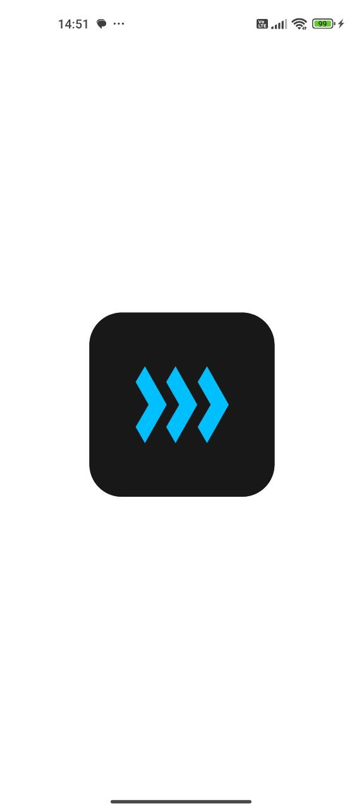
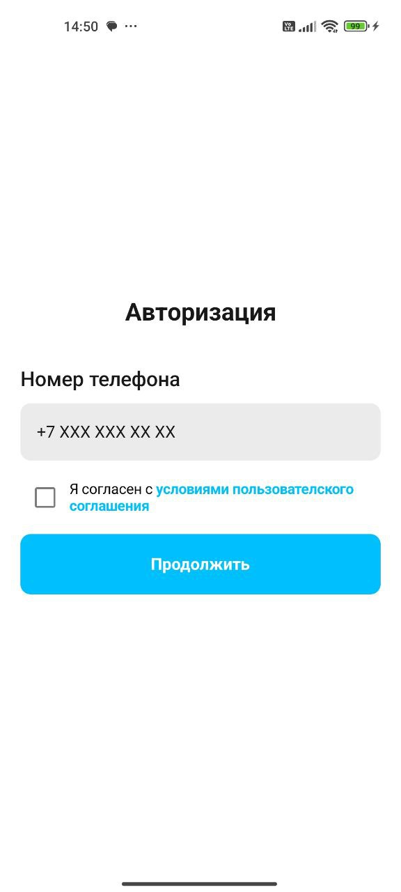
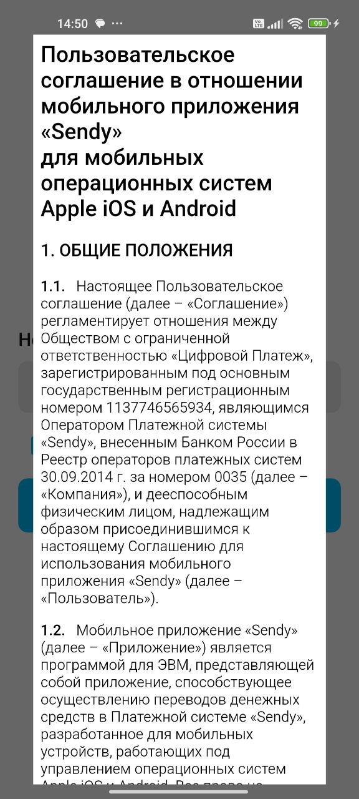
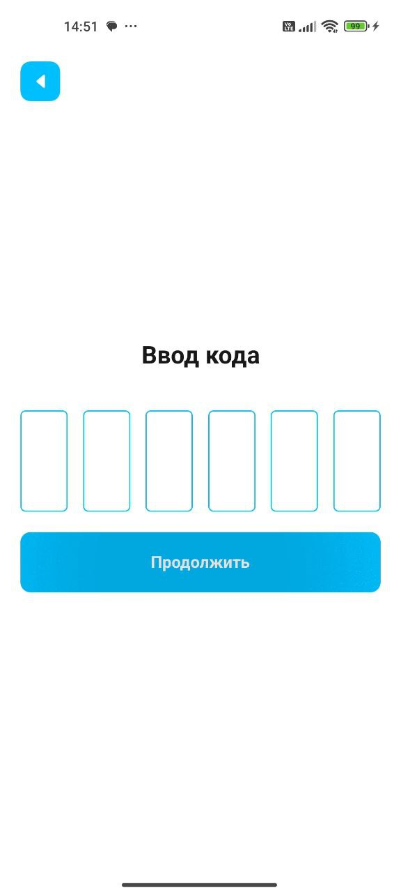
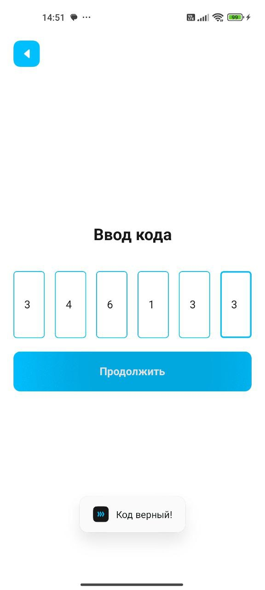
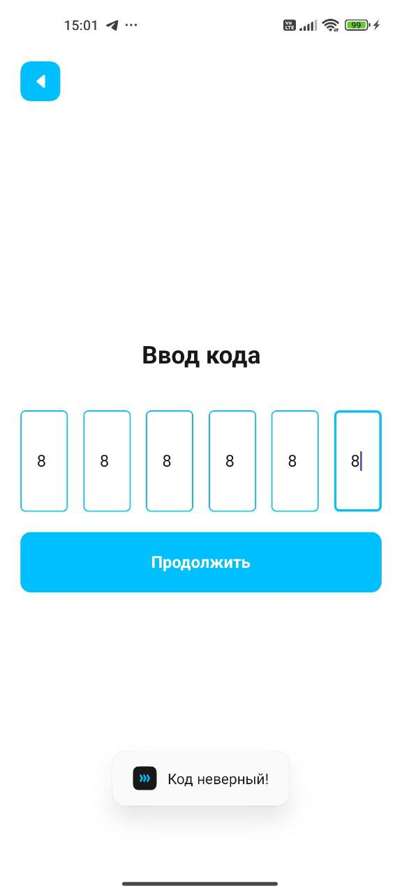

# Sendy app
Тема: мобильное приложение, выполненное по тестовому заданию от компании Sendy  

# Функционал  
Список экранов:  
- Splash
- Авторизация
- Регистрация  

Экран Splash:  
- Виден 3 секунды после запуска приложения
- Логотип в центре

  

Экран Авторизация:  
- При запуске экрана сразу запускается запрос на получение пользовательского соглашения
- Поле ввода номера с маской ввода
- Для отправки кода необходимо согласиться с условиями пользовательского соглашения: реализовано с помощью checkbox
- По нажатию на синий текст-подсказку в checkbox откроется AndroidView с содержанием пользовательского соглашения
- Предусмотрено обновление страницы (при обновлении отправляется запрос на получение пользовательского соглашения на случай, если пользователь не был подключён к интернету)
- По нажатию на кнопку "Продолжить", при условии прохождения валидации номера телефона, отправляется запрос на отправление кода по смс на введённый номер телефона. 

    
    

Экран Ввод кода:  
- После ввода цифры кода, фокус с поля ввода смещается вперёд.
- По нажатию на кнопку "Продолжить", при условии, что код заполнен, отправляется запрос на проверку кода.
- Кнопка назад

    
    
    

Дополнительно:
- Есть проверка на подключение к интернету перед отправкой запроса на сервер
- Обработка ошибок сервера
- Подключены логи
- Пользователю в случае ошибки выводится сообщение в всплывающее сообщение (или Toast)

## Установка
1. Склонировать/Скачать архивом проект
2. Открыть проект в Android Studio
3. Собрать проект на вашем мобильном телефоне  
 
## Описание коммитов
| Название | Описание                                                                            |
| -------- |-------------------------------------------------------------------------------------|
| docs     | изменения в документации проекта                                                    |
| feat     | добавление новой функциональности или возможности.                                  |
| layout   | создание нового шаблона или представления без добавления функционала                |
| style    | изменения в стиле кода, такие как добавление точек с запятой или изменение отступов |
| fix      | исправление ошибки или бага.                                                        |
| perf     | улучшение производительности приложения                                             |
| refactor | редактирование кода без изменения ошибок или добавления функционала                 |
| revert   | откат на предыдущую версию                                                          |
| merge    | слияние веток                                                                       |
| test     | добавление тестов                                                                   |

## Автор
[klmnvan GitHub](https://github.com/klmnvan) 